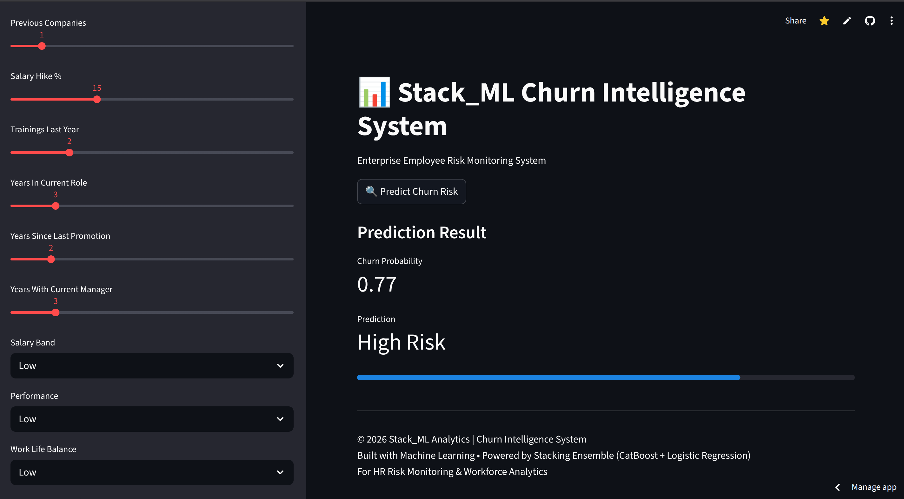
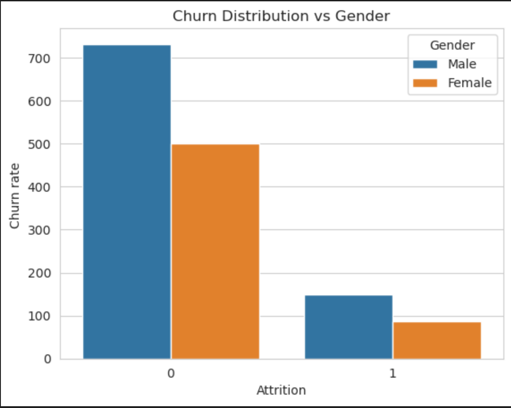
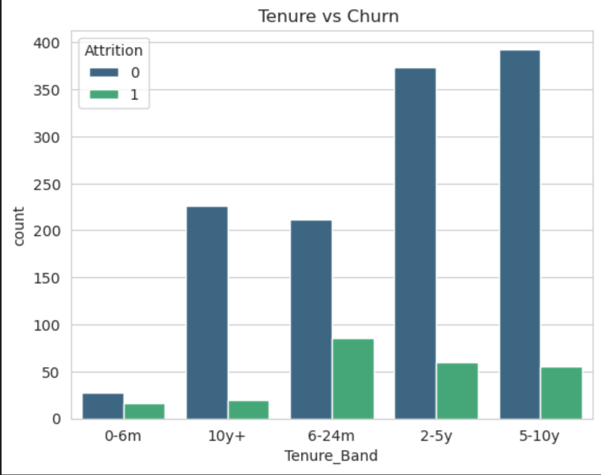
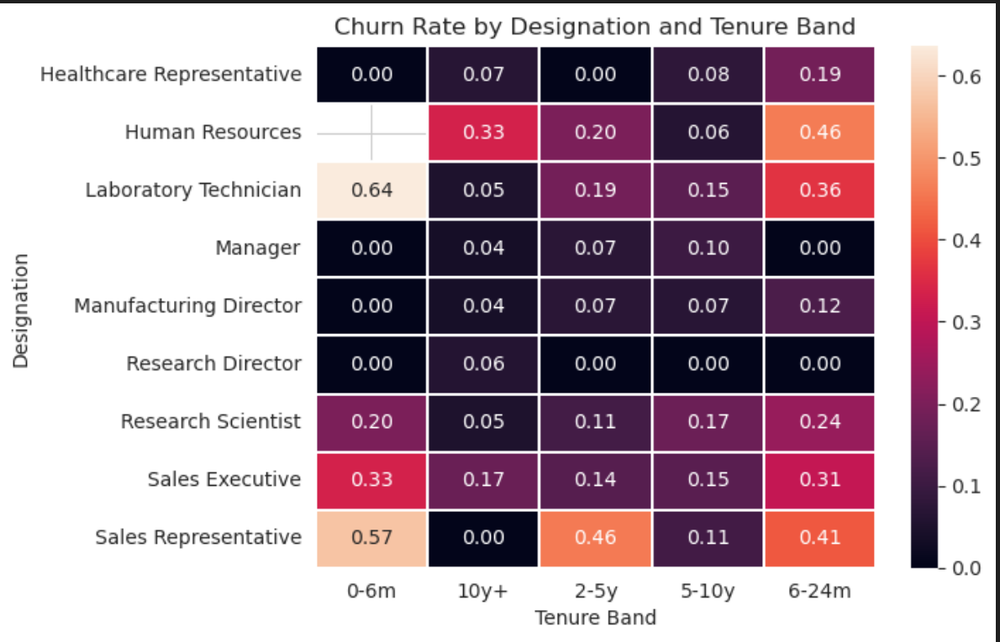
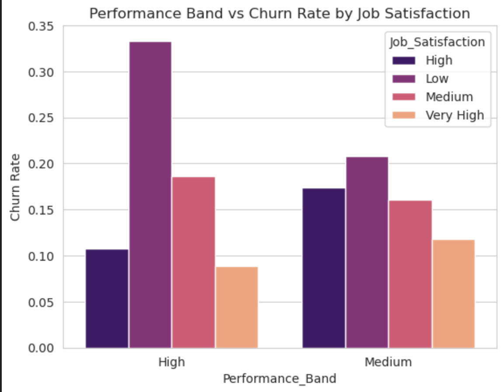
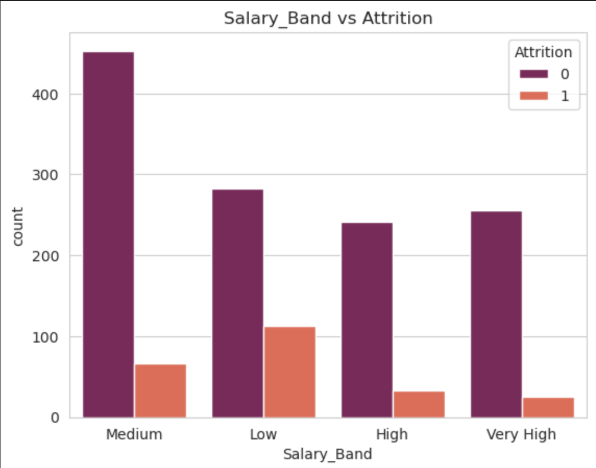
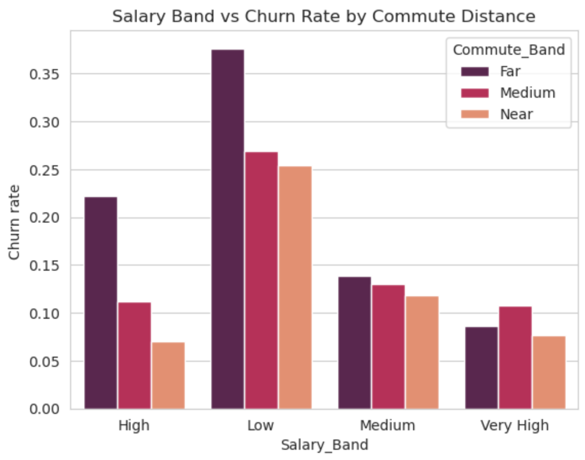
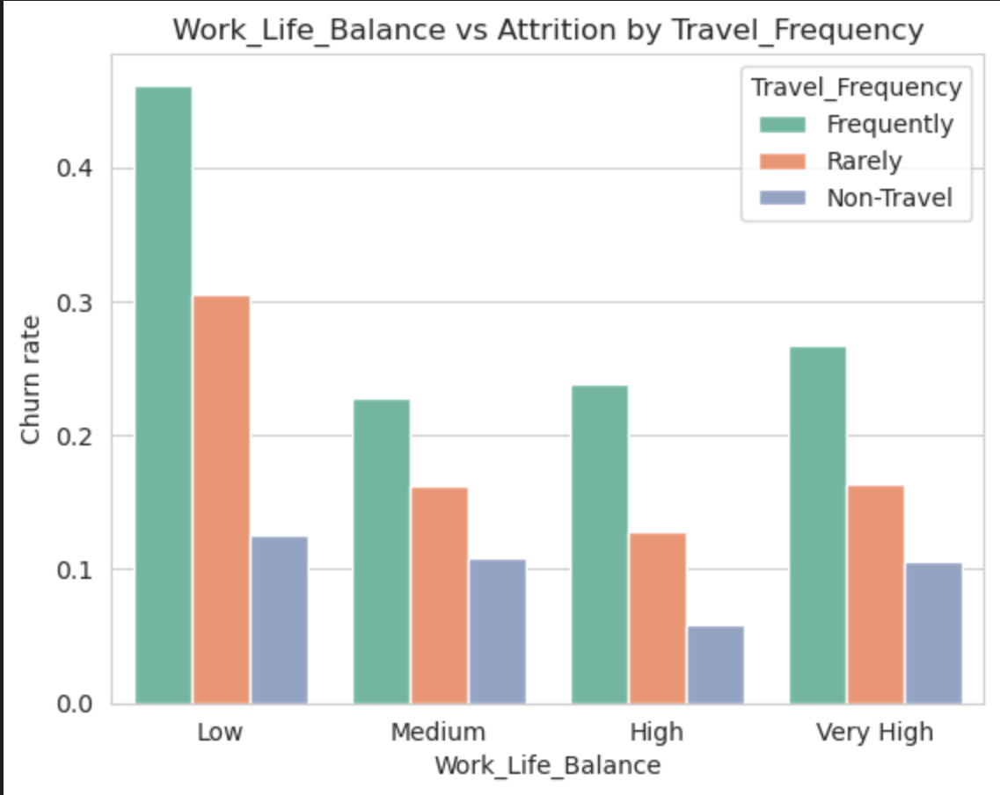
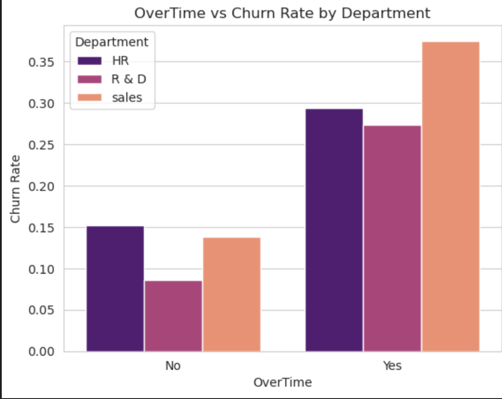

# 📊 HR Churn Intelligence System  
### Employee Attrition Prediction using Stacked Machine Learning

🔗 **Live App:** https://churnpredictionstack.streamlit.app/

# 📊 Streamlit Dashboard

Features:

- Interactive employee profile form
- Risk probability display
- Risk category (Low / Medium / High)
- Clean enterprise UI
- Real-time prediction using stacked model
- Production artifact loading via joblib




# 📦 Project Structure

```
HR-Churn-Intelligence/
│
├── models/
│   ├── stack_model.joblib
│   ├── preprocessor.joblib
│   ├── threshold.json
│   └── feature_schema.json
│
├── images/
│   ├── churn_vs_gender.png
│   ├── tenure_vs_attrition.png
│   ├── designation_tenure_vs_attrition.png
│   ├── performance_job_satisfaction.png
│   ├── performance_department.png
│   ├── salary_vs_attrition.png
│   ├── salary_commute_attrition.png
│   ├── wlb_travel_attrition.png
│   └── overtime_department_attrition.png
│
├── app/
│   └── app.py
│
├── streamlit_app.py
├── churn_notebook.ipynb
├── requirements.txt
└── README.md
```

# 📘 Project Overview

This project predicts **employee attrition risk** using structured HR data.

It demonstrates a complete **Machine Learning lifecycle**:

- Data Cleaning
- Exploratory Data Analysis (EDA)
- Feature Engineering
- Model Training & Comparison
- Hyperparameter Tuning
- Threshold Optimization
- Stacked Ensemble Modeling
- Production Deployment via Streamlit

The final model is a **Stacked Ensemble (Logistic Regression + CatBoost)** optimized for business-level precision and recall balance.


# 📊 Dataset Information

The dataset contains HR attributes related to employee satisfaction, performance, compensation, and experience.

| Feature | Description |
|----------|-------------|
| Age | Employee age |
| Gender | Male / Female |
| Department | Business function |
| Designation | Job role |
| Salary_Band | Compensation category |
| Work_Life_Balance | Satisfaction rating |
| Job_Satisfaction | Happiness rating |
| Environment_Satisfaction | Workplace satisfaction |
| Relationship_Satisfaction | Peer rating |
| Performance_Band | Performance evaluation |
| Travel_Frequency | Travel requirement |
| OverTime | Overtime status |
| Tenure_Band | Experience band |
| Attrition | 1 = Left Company, 0 = Stayed |


# 📈 Exploratory Data Analysis (EDA)

Performed in `churn.ipynb`


## 1️⃣ Churn Distribution by Gender



**Insight:**  
More male employees are observed in churn cases (relative workforce size should be considered).


## 2️⃣ Tenure vs Attrition



**Insight:**  
Employees within **6–24 months** are most likely to churn.


## 3️⃣ Designation & Tenure vs Churn



**Insight Highlights:**
- Lab Technicians & Sales Reps churn early (0–6 months)
- HR & Sales churn in 6–24 months
- Research Scientists churn in 5–10 years

Retention strategy must be role-specific.


## 4️⃣ Performance vs Job Satisfaction vs Churn



**Insight:**  
High-performing employees with low job satisfaction show the highest churn risk.


## 5️⃣ Performance vs Department


**Insight:**  
Sales (mid-performers) and R&D (high-performers) show elevated churn.


## 6️⃣ Salary Band vs Attrition



**Insight:**  
Low salary employees show the highest churn probability.


## 7️⃣ Salary vs Commute Distance vs Churn



**Insight:**  
Low salary + long commute = highest churn risk.


## 8️⃣ Work-Life Balance vs Travel Frequency



**Insight:**  
Low work-life balance combined with frequent travel significantly increases churn.


## 9️⃣ Overtime vs Department vs Churn



**Insight:**  
Higher overtime exposure correlates with elevated churn, especially in Sales.


# 🧠 Machine Learning Development Process

## 1️⃣ Data Cleaning
- Removed duplicates
- Handled categorical encoding
- Created engineered bands (Tenure, Salary, Commute)

## 2️⃣ Preprocessing Pipeline
- Ordinal Encoding for satisfaction & performance
- One-Hot Encoding for categorical features
- Numerical passthrough
- Used ColumnTransformer to prevent leakage

## 3️⃣ Baseline Models Tested
- Logistic Regression
- Random Forest
- XGBoost
- CatBoost
# 🤖 Machine Learning Model Comparison

| Model | Accuracy | Precision (Churn) | Recall (Churn) | F1 | ROC-AUC |
|--------|-----------|------------------|----------------|------|---------|
| Logistic Regression | 0.87 | 0.71 | 0.36 | 0.48 | 0.82 |
| Random Forest | 0.84 | 0.50 | 0.11 | 0.18 | 0.79 |
| XGBoost | 0.84 | 0.49 | 0.45 | 0.47 | 0.80 |
| CatBoost | 0.87 | 0.68 | 0.40 | 0.51 | 0.80 |
| 🏆 Stacked Ensemble | **0.89** | **0.74** | **0.49** | **0.59** | **0.83+** |


## 4️⃣ Hyperparameter Tuning
Applied:
- GridSearchCV
- RandomizedSearchCV

Focused on improving churn recall & F1 score.

## 5️⃣ Threshold Optimization
Default 0.5 threshold was suboptimal.

Tested thresholds from 0.2 → 0.5.

Selected **0.4 threshold** for best business balance:

- Higher precision than lower thresholds
- Acceptable recall
- Reduced false positives


# 🏆 Final Model: Stacked Ensemble

### Architecture:
- Base Models:
  - Logistic Regression
  - CatBoost
- Final Estimator:
  - Logistic Regression


### 📊 Final Performance @ 0.4 Threshold

| Metric | Value |
|---------|--------|
| Accuracy | 0.89 |
| Precision (Churn) | 0.74 |
| Recall (Churn) | 0.49 |
| F1 Score | 0.59 |
| ROC-AUC | 0.83+ |

Balanced and business-ready performance.


# 🧠 Skills Demonstrated

- Advanced EDA & Business Insight Extraction
- Feature Engineering
- Ensemble Learning & Stacking
- Hyperparameter Optimization
- Threshold Tuning
- Production Model Saving
- Streamlit Deployment


# ⚙️ Flask REST API

### Endpoints

| Route | Method | Description |
|--------|---------|-------------|
| `/` | GET | Health check |
| `/predict` | POST | Returns churn probability & risk category |

### Example Response

```json
{
  "churn_probability": 0.62,
  "prediction": "High Risk",
  "threshold_used": 0.4
}
```

# 📌 Conclusion

This project delivers a production-ready **HR Analytics Intelligence System** capable of identifying high-risk employees using advanced ensemble learning.

The final stacked model provides strong precision while maintaining meaningful recall, making it suitable for strategic workforce retention planning.
